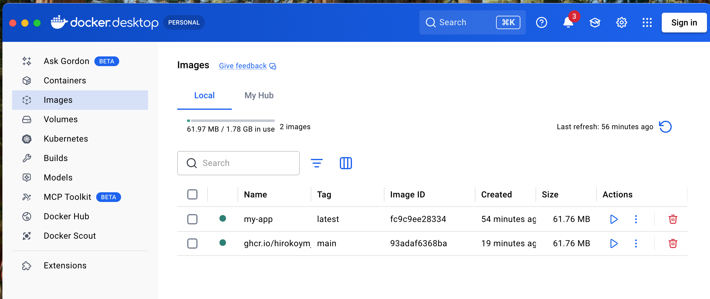

# React + TypeScript + Vite

## Docker command

1. Open Docker Desktop app

```bash
# Build the image
docker build -t my-app .

# Run the container
docker run -p 8080:80 my-app

http://localhost:8080

# List all local images
docker images

IMAGE           ID             DISK USAGE   CONTENT SIZE   EXTRA
my-app:latest   fc9c9ee28334       61.8MB             0B    U
```

### The Dockerfile uses a two-stage build:

- **Builder** — node:22-alpine installs deps and runs npm run build (outputs to dist/)
- **Server** — nginx:alpine copies the built static files and serves them on port 80

### Package (GitHub Container Registry)

```bash
docker pull ghcr.io/hirokoymj/react-docker-test:main
docker run -p 8080:80 ghcr.io/hirokoymj/react-docker-test:main
```


